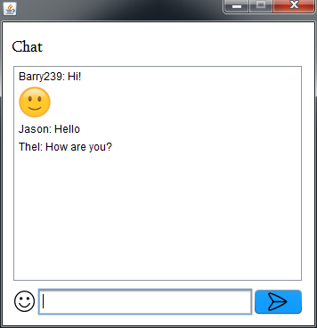

# Chat

Basic chat build in Java.

* Send a message to all the users in the room or send a private message mentioning the user with an at sign (example: `@username`).
* Send emojis via codes.

# Usage
1. Run `ServerMain.java` file to start the server.
2. Set a port number (default: `239`).
3. Run `Main.java` file to connect to the server.
4. Choose a username.
5. Set the server IP address and port (example: `127.0.0.1:239`).

# Known bugs
* If a username is used more than once, a private message will reach everyone with the same name.